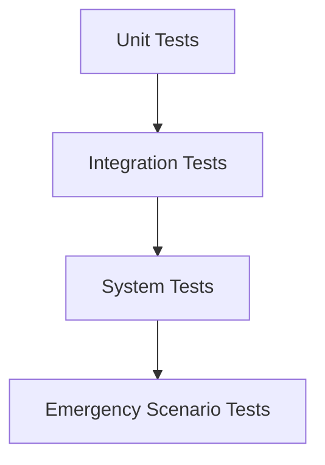

## Summary

Provide a concise overview of the proposed configuration change including:
- Affected modules from [Implementation Strategy](../../docs/implementation_strategy.md)
- Thread continuity plan per section 4 of implementation strategy
- Compliance with 95% test coverage requirement

## Change Description

### Implementation Alignment
- [ ] Maps to specific module in [Implementation Strategy](../../docs/implementation_strategy.md#implementation-modules--ai-instructions)
- [ ] Includes thread handoff documentation per [Status Tracking Template](../../docs/implementation_strategy.md#status-tracking-template)

### Configuration Impact
- List modified files with version hashes
- Detail environment-specific changes (dev/test/prod)
- Reference backup files in backup_tests/ directory

## Testing Requirements

### Mandatory Verification
- [ ] `test_health_check` passing with updated thresholds
- [ ] 95% coverage maintained for core modules
- [ ] Integration tests updated in crypto_j_trader/tests/integration/

### Test Types


## Process Compliance

- [ ] Follows [Configuration Management](../../docs/configuration_management.md) section 3.2 change approval process
- [ ] Includes rollback procedure documentation
- [ ] Validates against current [trading_config.json](../../config/trading_config.json) schema

## Documentation

### Required Updates
- [ ] [Implementation Strategy](../../docs/implementation_strategy.md) status tracking
- [ ] [Configuration Management](../../docs/configuration_management.md) change log
- [ ] Relevant markdown in Updates/ directory with format:
    ```YYYYMMDD_<module>_config_change.md```

### Verification Steps
- [ ] Peer review completed
- [ ] Documentation cross-linked
- [ ] Automated check: `python scripts/init_config.py --validate`