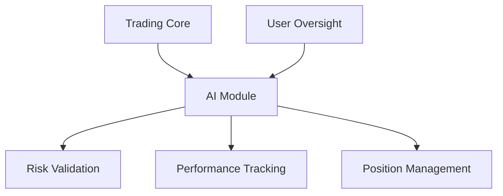
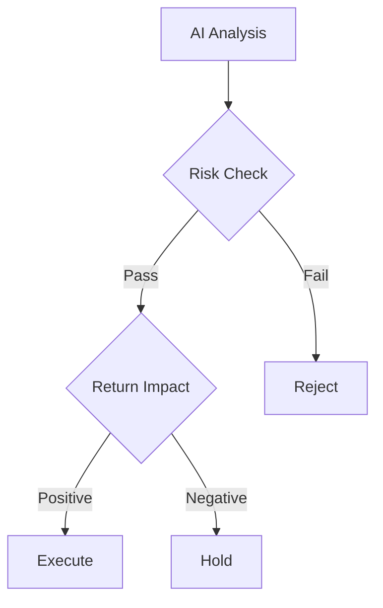
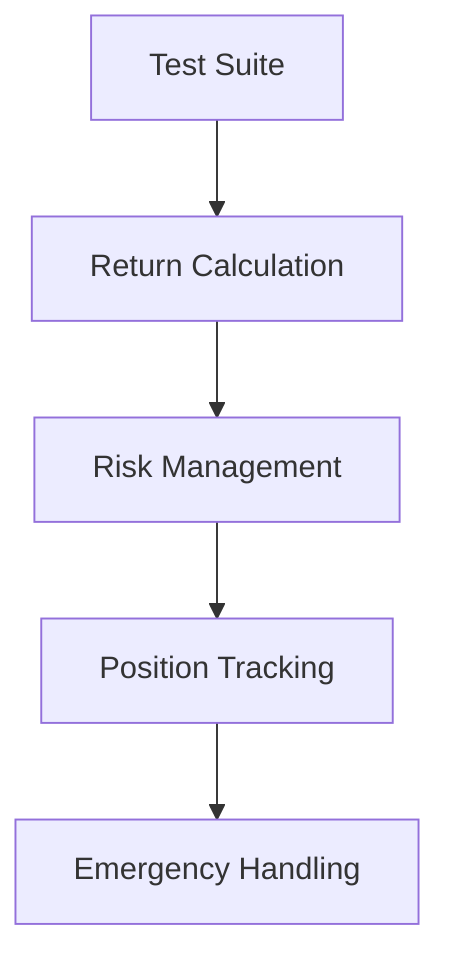
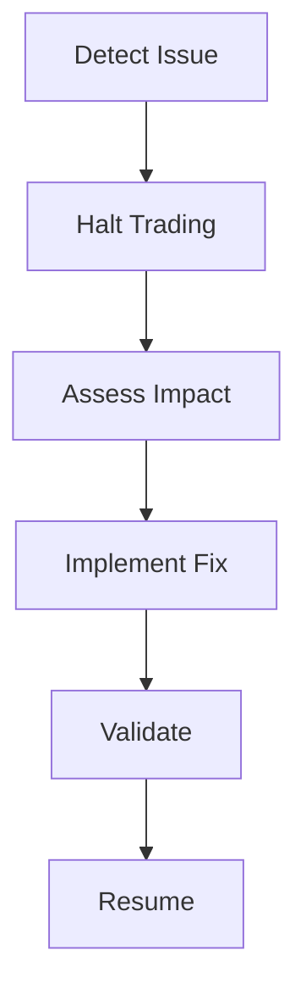

# AI Interaction Guidelines

## Overview
This document establishes guidelines for AI interactions within the CryptoJ Trading system, designed for single-user operation with specific performance targets.

## Core Objectives

### 1. Performance Targets
```json
{
  "return_targets": {
    "annual_target": "40%",
    "minimum_acceptable": "20%",
    "drawdown_limit": "15%",
    "position_size_limit": "2%"
  }
}
```

### 2. Risk Parameters
```json
{
  "risk_limits": {
    "max_position_size": "2%",
    "portfolio_drawdown": "15%",
    "daily_drawdown": "5%",
    "confidence_threshold": 0.85
  }
}
```

## AI Integration Framework

### 1. System Architecture


### 2. Interaction Types
```json
{
  "ai_interactions": {
    "performance_tracking": {
      "type": "monitoring",
      "priority": "critical",
      "metrics": ["return_progress", "risk_compliance"]
    },
    "trade_validation": {
      "type": "validation",
      "priority": "critical",
      "checks": ["position_size", "risk_limits", "return_impact"]
    },
    "position_management": {
      "type": "advisory",
      "priority": "high",
      "focus": ["return_optimization", "risk_control"]
    }
  }
}
```

## Safety Controls

### 1. Validation Requirements
```python
def validate_ai_decision(decision):
    """
    Validation requirements:
    1. Position size <= 2% of portfolio
    2. Current drawdown within limits
    3. Return target alignment
    4. Risk parameter compliance
    5. Emergency conditions check
    """
```

### 2. Decision Flow


## Interaction Protocols

### 1. Message Format
```json
{
  "message": {
    "type": "trade|analysis|alert",
    "timestamp": "ISO8601",
    "content": {
      "action": "string",
      "reasoning": "string",
      "return_impact": "float",
      "risk_assessment": "object"
    }
  }
}
```

### 2. Response Handling
```python
def process_ai_response():
    """
    Response handling:
    1. Verify return target alignment
    2. Check risk compliance
    3. Validate position sizing
    4. Log interaction
    5. Execute or hold
    """
```

## Performance Monitoring

### 1. Return Tracking
```json
{
  "tracking_metrics": {
    "annual_return": "percentage",
    "return_progress": "percentage_to_target",
    "risk_adjusted_return": "float",
    "drawdown": "percentage"
  }
}
```

### 2. Risk Monitoring
```json
{
  "risk_metrics": {
    "position_sizes": "percentage",
    "portfolio_risk": "float",
    "current_drawdown": "percentage",
    "risk_limit_status": "object"
  }
}
```

## Testing Requirements

### 1. Paper Trading Validation
**Test Categories:**
- Return calculation accuracy
- Position size enforcement
- Risk limit compliance
- Emergency procedures
- Performance tracking

### 2. System Tests


## Emergency Procedures

### 1. Emergency Triggers
**Shutdown Conditions:**
- Daily drawdown > 5%
- Portfolio drawdown > 15%
- Position size violation
- System anomalies
- Data inconsistencies

### 2. Recovery Process


## Trade Management

### 1. Entry Validation
**Requirements:**
- Position size check
- Return potential analysis
- Risk limit verification
- Market condition assessment
- Strategy alignment

### 2. Position Monitoring
**Continuous Checks:**
- Return contribution
- Risk compliance
- Performance impact
- Exit conditions

## Success Criteria

### 1. Performance Requirements
- Progress toward 40% annual return
- Minimum 20% return maintained
- Drawdown within 15% limit
- Position sizes under 2%

### 2. System Requirements
- Order execution accuracy: 100%
- Risk compliance: 100%
- Data accuracy: 100%
- System uptime: 99.9%

## Implementation Guidelines

### 1. Trade Execution
- Verify position sizing
- Check return impact
- Validate risk levels
- Monitor performance contribution

### 2. Risk Management
- Continuous limit monitoring
- Real-time position tracking
- Performance impact assessment
- Emergency readiness

## Documentation Requirements

### 1. System Logs
```json
{
  "log_entry": {
    "timestamp": "ISO8601",
    "action": "string",
    "return_impact": "float",
    "risk_status": "object",
    "validation": "object"
  }
}
```

### 2. Performance Reports
- Daily return tracking
- Risk limit status
- Position summaries
- Strategy effectiveness
