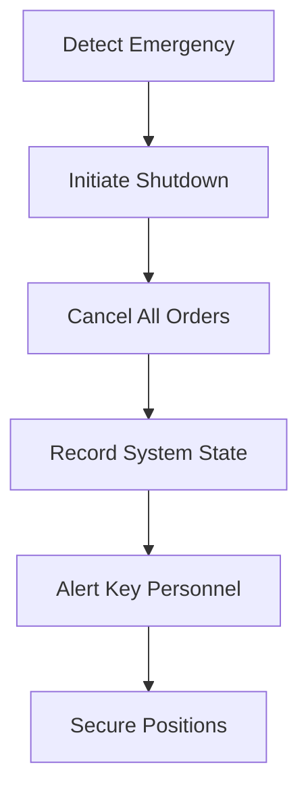
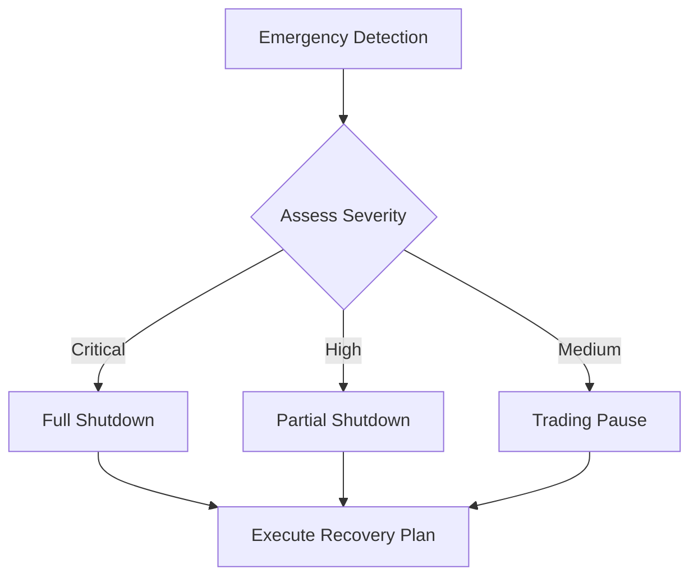
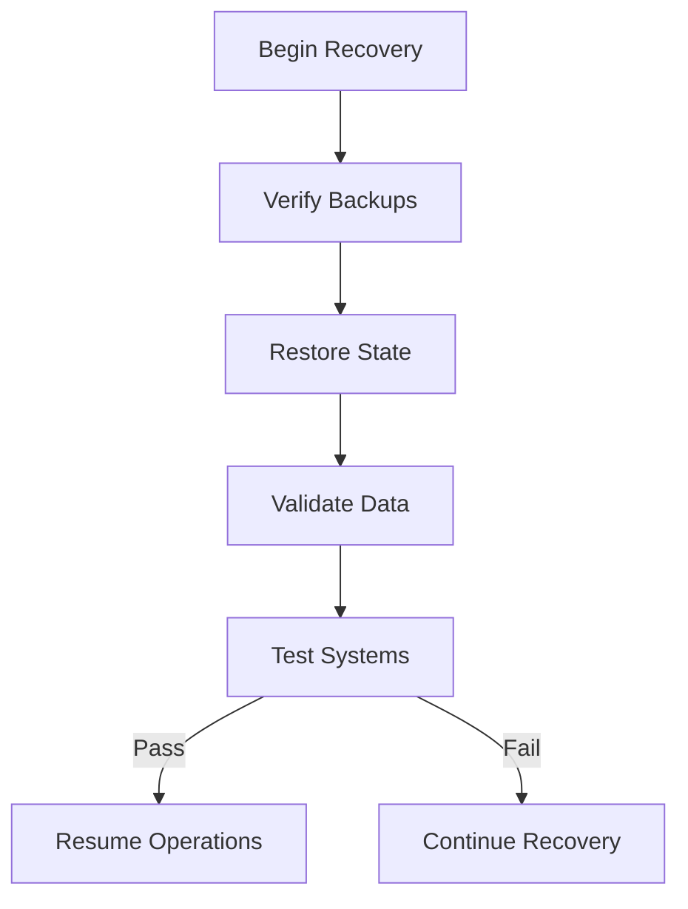

# Emergency Procedures

## Overview
This document details the emergency procedures and protocols for the CryptoJ Trading system's paper trading operations. These procedures must be followed in any critical situation to ensure system safety and data integrity.

## Emergency Shutdown Triggers

### 1. System-Level Triggers
```json
{
  "cpuUsage": 90,          // Percentage threshold
  "memoryUsage": 85,       // Percentage threshold
  "responseLatency": 1000, // Milliseconds
  "errorRate": 5          // Errors per minute
}
```

### 2. Trading-Level Triggers
```json
{
  "dailyLoss": "5%",       // Maximum daily drawdown
  "positionLoss": "2%",    // Single position loss limit
  "orderFrequency": 10,    // Orders per minute
  "dataLatency": 5000     // Market data delay in ms
}
```

### 3. Market-Level Triggers
```json
{
  "priceVolatility": "5%",  // Sudden price change
  "spreadDeviation": "2%",  // Abnormal spread
  "volumeDeviation": "300%", // Unusual volume spike
  "marketDataGap": 30      // Seconds without updates
}
```

## Emergency Response Procedures

### 1. Immediate Response Protocol


**Steps:**
1. System Pause
   - Halt all trading operations
   - Cancel pending orders
   - Prevent new order submission
   - Lock position modifications

2. State Capture
   - Record all open positions
   - Save system configuration
   - Capture market data state
   - Log trigger conditions

3. Notification
   - Alert system administrators
   - Notify risk managers
   - Record incident details
   - Initialize response team

### 2. Emergency Response Flowchart


## System Recovery Process

### 1. Assessment Phase
1. **System Analysis**
   - Check system logs
   - Analyze error reports
   - Review state dumps
   - Verify data integrity

2. **Impact Evaluation**
   - Assess position status
   - Calculate potential losses
   - Review affected components
   - Document findings

### 2. Recovery Steps


## Emergency Contacts

### 1. Response Team
- System Administrator
- Risk Manager
- Technical Lead
- Operations Manager
- Compliance Officer

### 2. Communication Protocol
1. Initial Alert
   - Automated system notifications
   - Emergency team notification
   - Status updates
   - Incident logging

2. Updates
   - Regular status reports
   - Resolution progress
   - System status
   - Recovery timeline

## Recovery Requirements

### 1. System Validation
**Pre-Recovery Checks:**
- Configuration integrity
- Data consistency
- System connectivity
- Service status

**Post-Recovery Validation:**
- Trading capability
- Position accuracy
- Risk controls
- System performance

### 2. Trading Resume Checklist
1. **System Health**
   - [ ] Core services operational
   - [ ] Market data feeds active
   - [ ] Database connectivity
   - [ ] Monitoring systems

2. **Data Validation**
   - [ ] Position data accurate
   - [ ] Order history verified
   - [ ] Risk limits configured
   - [ ] Market data valid

3. **Security Checks**
   - [ ] Access controls active
   - [ ] Permissions verified
   - [ ] Logging enabled
   - [ ] Monitoring active

## Documentation Requirements

### 1. Incident Documentation
**Required Information:**
- Incident timestamp
- Trigger condition
- System state
- Actions taken
- Resolution steps
- Prevention measures

**Format:**
```markdown
## Incident Report
- Date: YYYY-MM-DD
- Time: HH:MM:SS
- Trigger: [Description]
- Impact: [Assessment]
- Resolution: [Steps taken]
- Prevention: [Future measures]
```

### 2. Recovery Documentation
**Required Records:**
- Recovery steps taken
- System state changes
- Validation results
- Test outcomes
- Sign-off status

## Prevention Measures

### 1. Regular System Checks
- Daily health monitoring
- Weekly performance review
- Monthly system audit
- Quarterly recovery drills

### 2. Monitoring Requirements
```json
{
  "healthChecks": {
    "frequency": "1m",
    "timeout": "5s"
  },
  "stateBackups": {
    "frequency": "1h",
    "retention": "7d"
  },
  "dataValidation": {
    "frequency": "5m",
    "tolerance": "0.1%"
  }
}
```

## Testing Schedule

### 1. Regular Testing
- Daily system checks
- Weekly recovery tests
- Monthly full drills
- Quarterly audits

### 2. Test Requirements
- Emergency shutdown verification
- Recovery procedure validation
- Communication protocol testing
- System restore validation
