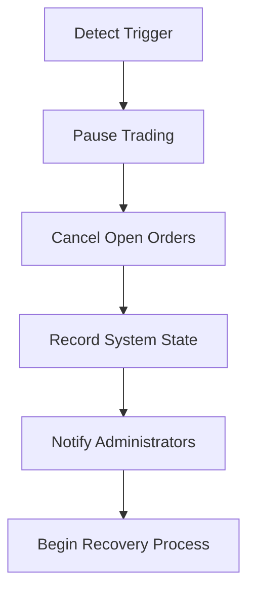
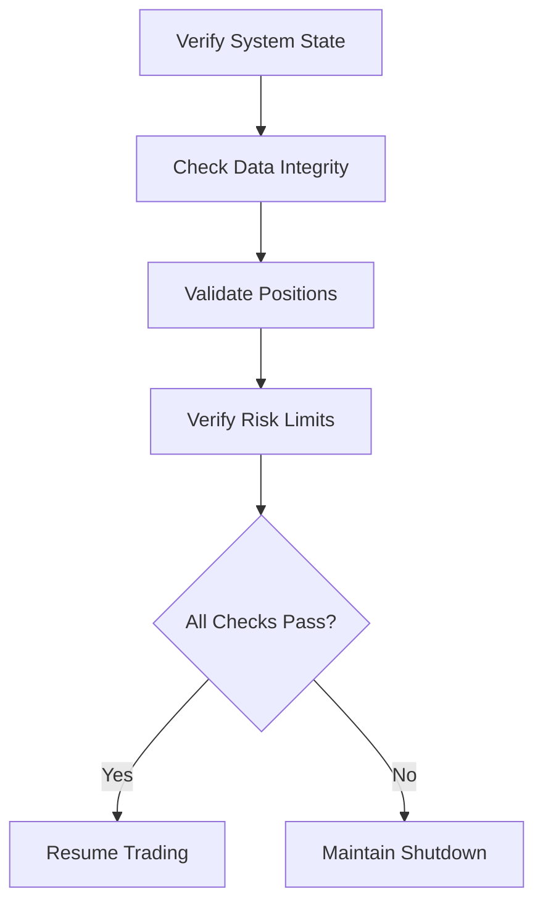
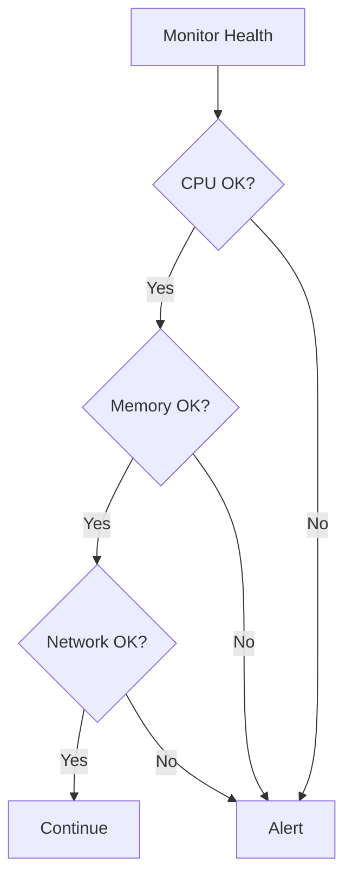

# Risk Management Procedures

## Overview
This document outlines the risk management procedures and controls for the CryptoJ Trading system's paper trading implementation.

## Risk Control Parameters

### 1. Position Limits
```json
{
  "maxPositionSize": "5%",  // Maximum position size as percentage of portfolio
  "maxOpenPositions": 5,    // Maximum number of concurrent open positions
  "maxLeverage": 1,        // No leverage in paper trading
  "positionTimeout": 7200  // Maximum position hold time in seconds
}
```

### 2. Order Controls
```json
{
  "maxOrderSize": "2%",     // Maximum single order size
  "maxOrdersPerMinute": 10, // Rate limiting
  "minOrderInterval": 1000, // Minimum ms between orders
  "maxRetries": 3          // Maximum order retry attempts
}
```

### 3. Loss Limits
```json
{
  "maxDrawdown": "5%",      // Maximum daily drawdown
  "maxPositionLoss": "2%",  // Maximum loss per position
  "stopLossRequired": true, // Mandatory stop loss
  "takeProfitRequired": true // Mandatory take profit
}
```

## Risk Monitoring Procedures

### 1. Real-time Position Monitoring
**Process:**
1. Track open positions continuously
2. Monitor position sizes and exposure
3. Verify against position limits
4. Track P&L for each position
5. Monitor aggregated risk exposure

**Actions:**
- Alert on position limit approach (80% threshold)
- Prevent new positions when limits reached
- Force position reduction if limits exceeded
- Log all limit violations

### 2. Loss Management
**Process:**
1. Calculate real-time P&L
2. Monitor drawdown levels
3. Track loss thresholds
4. Verify stop-loss orders

**Actions:**
- Alert on approaching loss limits
- Trigger emergency shutdown on limit breach
- Log all loss-related events
- Generate incident reports

## Emergency Procedures

### 1. Emergency Shutdown Triggers
- Position limit breaches
- Loss limit violations
- System health issues
- Market data anomalies
- Configuration errors
- Critical system errors

### 2. Shutdown Procedure


1. **Immediate Actions**
   - Pause all trading activities
   - Cancel pending orders
   - Record system state
   - Alert administrators

2. **State Preservation**
   - Capture position data
   - Record account status
   - Save configuration state
   - Document trigger cause

### 3. Recovery Process


## Validation Requirements

### 1. Pre-Trade Validation
**Configuration:**
- Trading pair settings
- Order parameters
- Risk limits
- System state

**Risk Checks:**
- Position limits
- Order size limits
- Loss thresholds
- Trading frequency

### 2. Continuous Monitoring
**System Health:**


**Market Data:**
- Price data validity
- Feed consistency
- Update frequency
- Data accuracy

## Recovery Requirements

### 1. System Recovery
**Validation Steps:**
1. Verify system state
2. Check data integrity
3. Validate positions
4. Confirm risk limits
5. Test trading capabilities

**Recovery Actions:**
1. Restore from backup if needed
2. Verify configuration
3. Check position data
4. Test order systems
5. Validate risk controls

### 2. Trading Resume
**Prerequisites:**
- All systems operational
- Risk controls verified
- Positions confirmed
- Market data valid

**Process:**
1. Enable paper trading
2. Verify order execution
3. Confirm position tracking
4. Monitor risk metrics
5. Log system status

## Documentation Requirements

### 1. Incident Reports
- Trigger description
- System state
- Actions taken
- Resolution steps
- Prevention measures

### 2. Audit Logs
- Risk limit checks
- Position changes
- Order activities
- System events
- Recovery actions

## Regular Reviews

### 1. Daily Checks
- Risk limit compliance
- Position accuracy
- System performance
- Data consistency

### 2. Weekly Reviews
- Incident analysis
- Performance metrics
- Risk parameter assessment
- System health review

### 3. Monthly Audits
- Full system review
- Risk control assessment
- Procedure validation
- Documentation update
