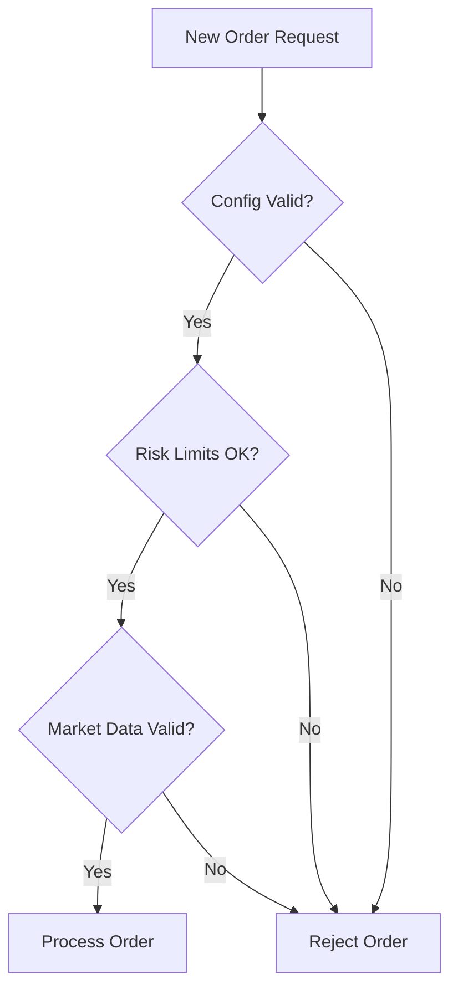
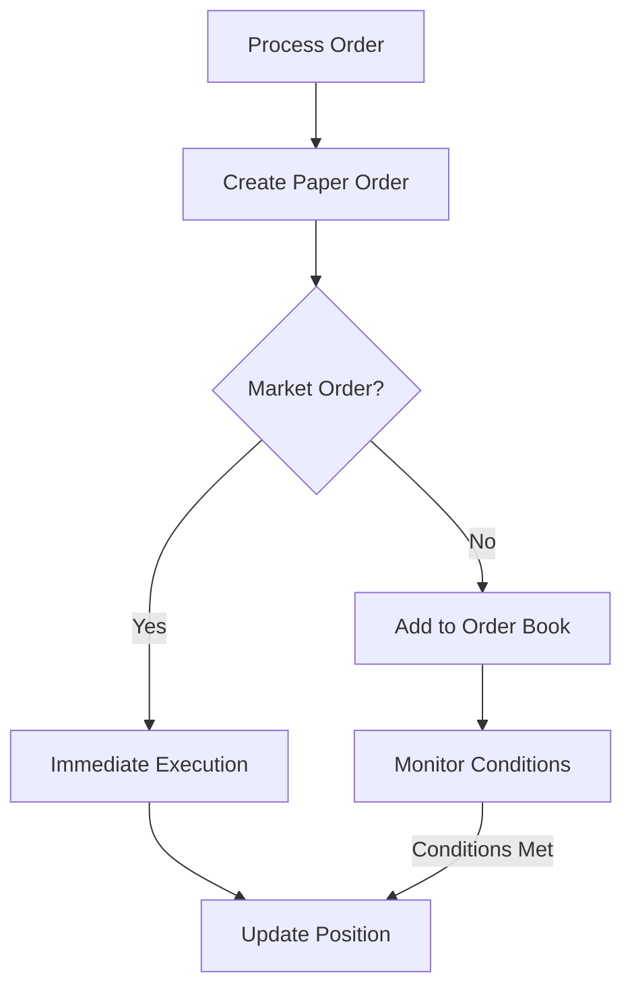
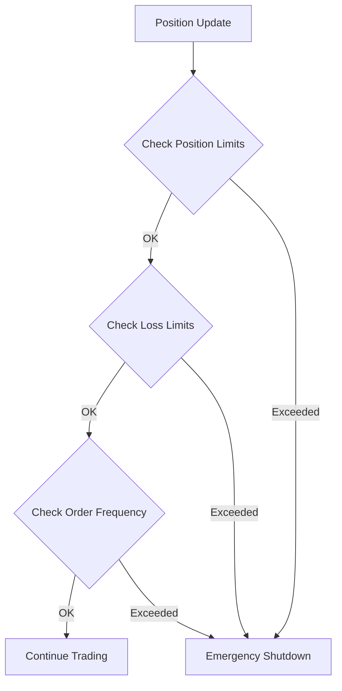
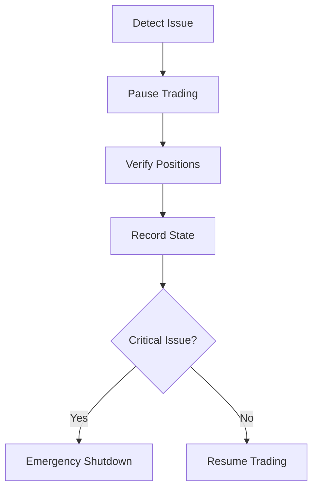
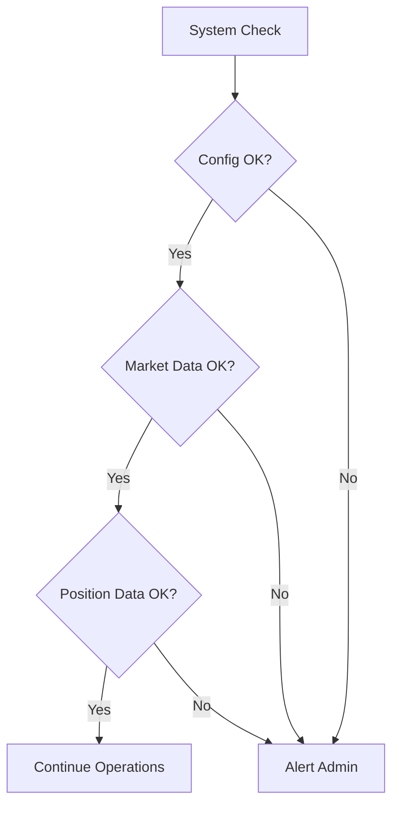
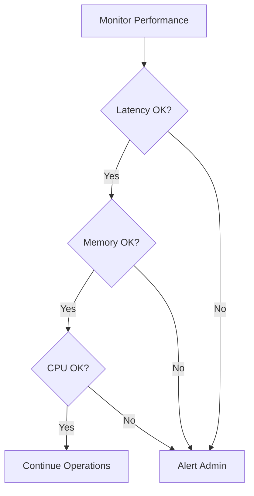
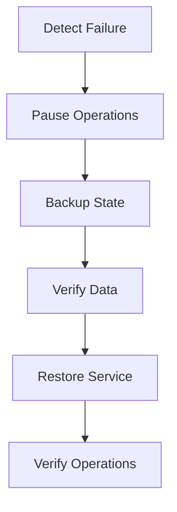
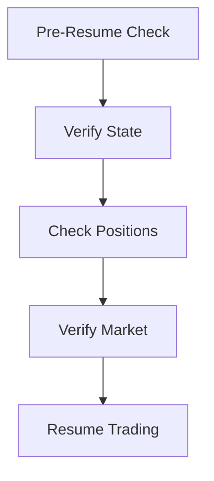

# Trading Operation Workflows

## Overview
This document outlines the key trading operation workflows for the CryptoJ Trading system's paper trading implementation.

## Order Execution Flow

### 1. Pre-Trade Validation

1. **Configuration Validation**
   - Verify trading pair configuration
   - Validate order parameters
   - Check trading permissions
   - Confirm system state

2. **Risk Assessment**
   - Check position limits
   - Verify order size limits
   - Validate loss thresholds
   - Confirm trading frequency

3. **Market Data Verification**
   - Validate price data
   - Check spread limits
   - Verify market status
   - Confirm data freshness

### 2. Order Processing

1. **Paper Order Creation**
   - Generate order ID
   - Record timestamp
   - Store order details
   - Initialize tracking

2. **Execution Logic**
   - Market order processing
   - Limit order handling
   - Price determination
   - Execution timing

3. **Position Management**
   - Update positions
   - Record transactions
   - Calculate P&L
   - Update risk metrics

## Risk Management Flow

### 1. Real-time Monitoring

1. **Position Monitoring**
   - Track open positions
   - Monitor position sizes
   - Calculate exposure
   - Verify limits

2. **Loss Management**
   - Track P&L
   - Monitor drawdown
   - Verify loss limits
   - Check thresholds

3. **Frequency Control**
   - Monitor order rates
   - Track execution times
   - Verify intervals
   - Control bursts

### 2. Emergency Response

## System Health Flow

### 1. Health Monitoring

1. **Configuration Checks**
   - Verify settings
   - Validate parameters
   - Check permissions
   - Confirm state

2. **Data Validation**
   - Verify market data
   - Check position data
   - Validate orders
   - Confirm consistency

### 2. Performance Monitoring

## Recovery Procedures

### 1. System Recovery

1. **Failure Detection**
   - Identify issues
   - Log problems
   - Alert personnel
   - Secure state

2. **Recovery Process**
   - Backup data
   - Verify state
   - Restore service
   - Confirm operations

### 2. Trading Resume

## Validation Requirements

### 1. Pre-Trading Validation
- Configuration check
- Risk limit verification
- Market data validation
- System health check

### 2. Operational Validation
- Order execution verification
- Position tracking accuracy
- Risk limit enforcement
- Emergency procedure testing

### 3. Recovery Validation
- State verification
- Data consistency check
- System health verification
- Trading capability confirmation
