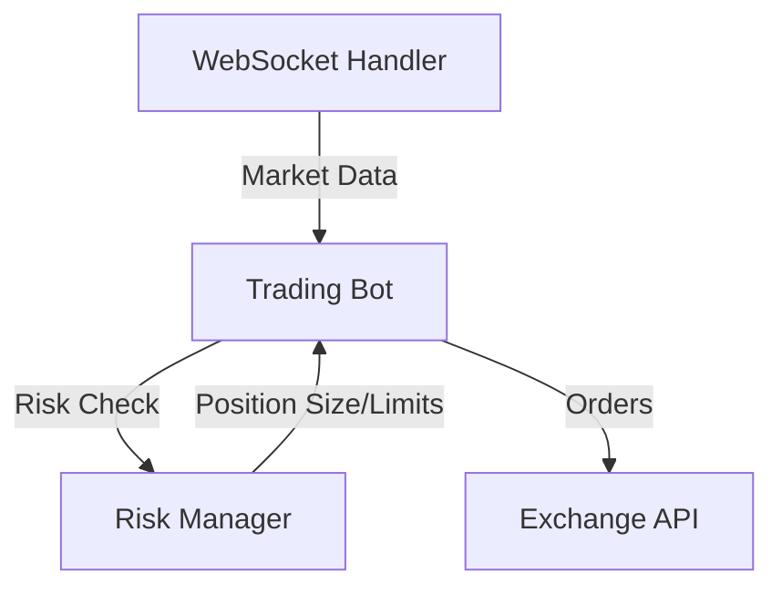

# Minimal Viable Crypto Trading Bot Implementation Guide

## 1. Core Components Analysis

### trading_core.py
**Essential Components to Keep:**
- Basic TradingBot class initialization and configuration loading
- Simple order execution functionality
- WebSocket integration for market data
- Basic system health monitoring
- Emergency shutdown capability

**Recommended Simplifications:**
- Remove TechnicalAnalysis class (defer complex indicators)
- Remove TradingStrategy class (use simple entry/exit rules)
- Remove PortfolioManager class (use basic position tracking)
- Simplify configuration structure
- Focus on single trading pair initially

### risk_management.py
**Essential Components to Keep:**
- Daily loss limit tracking
- Basic position sizing
- Simple stop-loss calculation
- Risk limit enforcement

**Recommended Simplifications:**
- Remove correlation risk calculations
- Remove complex Kelly criterion implementation
- Simplify ATR-based stop loss to fixed percentage
- Focus on core risk parameters

### websocket_handler.py
**Essential Components to Keep:**
- Basic WebSocket connection management
- Market data subscription
- Reconnection handling
- Message processing pipeline

**Recommended Simplifications:**
- Focus on single data channel (market_trades)
- Simplify error handling
- Remove complex subscription management
- Streamline callback system

## 2. Specific Code Improvements

### trading_core.py
1. Simplify initialization:
```python
def __init__(self, config_path: str = './config.json'):
    self.config = self.load_config(config_path)
    self.client = self.setup_api_client()
    self.risk_manager = RiskManager(self.config)
    self.websocket_handler = None
    self.market_data = {}
    self.positions = {}  # Simple position tracking
    self.shutdown_requested = False
```

2. Streamline trading loop:
```python
async def run_trading_loop(self):
    if self.config.get('websocket', {}).get('enabled', False):
        self.websocket_handler = WebSocketHandler(self.config)
        await self.websocket_handler.start()

    while not self.shutdown_requested:
        try:
            # Basic health check
            if not self._check_system_health():
                await asyncio.sleep(30)
                continue

            # Process market data
            for pair in self.config['trading_pairs']:
                await self._process_trading_pair(pair)

            await asyncio.sleep(self.config['execution']['interval_seconds'])
        except Exception as e:
            logger.error(f"Error in trading loop: {e}")
            await asyncio.sleep(5)
```

### risk_management.py
1. Simplify position sizing:
```python
def calculate_position_size(self, portfolio_value: float) -> float:
    """Simple position sizing based on fixed percentage"""
    return portfolio_value * self.position_size_limit
```

2. Streamline stop loss:
```python
def calculate_stop_loss(self, entry_price: float) -> float:
    """Fixed percentage stop loss"""
    return entry_price * (1 - self.stop_loss_pct)
```

### websocket_handler.py
1. Simplify message processing:
```python
async def _process_message(self, data: Dict) -> None:
    if data.get('type') == 'market_trades':
        pair_id = data.get('product_id')
        if pair_id in self.callbacks:
            try:
                await self.callbacks[pair_id](data)
            except Exception as e:
                logger.error(f"Callback error: {e}")
```

## 3. Component Interaction Improvements

1. **Data Flow Simplification:**


2. **Error Handling Chain:**
- WebSocket errors → Trading Bot → Emergency Shutdown
- Risk limit breaches → Trading Bot → Position Close
- API errors → Trading Bot → Retry/Shutdown

## 4. Error Handling and Logging

1. **Structured Logging:**
```python
logging.basicConfig(
    level=logging.INFO,
    format='%(asctime)s - %(name)s - %(levelname)s - %(message)s',
    handlers=[
        logging.FileHandler('trading_bot.log'),
        logging.StreamHandler()
    ]
)
```

2. **Critical Error Points:**
- WebSocket connection failures
- API authentication errors
- Order execution failures
- Risk limit breaches
- System health check failures

3. **Recovery Procedures:**
- Implement exponential backoff for reconnections
- Auto-reset daily loss tracking at market open
- Graceful shutdown on critical errors

## 5. Security Best Practices

1. **API Key Management:**
```python
def load_api_keys(self) -> Dict[str, str]:
    try:
        with open(os.environ.get('API_KEY_PATH'), 'r') as f:
            return json.load(f)
    except Exception as e:
        logger.error(f"Failed to load API keys: {e}")
        raise
```

2. **Risk Controls:**
- Implement maximum order size limits
- Set strict daily loss limits
- Enforce position size restrictions
- Validate all incoming market data

3. **System Security:**
- Use environment variables for sensitive data
- Implement API request signing
- Validate WebSocket message authenticity
- Log all critical operations

## Implementation Timeline

### Week 1: Basic Setup and Testing
- Day 1-2: Core implementation and simplification
- Day 3: Basic testing and validation
- Day 4-5: Paper trading setup and testing

### Week 2: Live Trading Preparation
- Day 1-2: Risk management validation
- Day 3: Live configuration setup
- Day 4-5: Controlled live trading launch

## Success Metrics
1. Reliable market data streaming
2. Consistent order execution
3. Proper risk limit enforcement
4. Accurate position tracking
5. Stable system operation

## Next Steps After MVP
1. Add technical indicators
2. Implement portfolio management
3. Enhance risk controls
4. Add advanced monitoring
5. Implement complex trading strategies