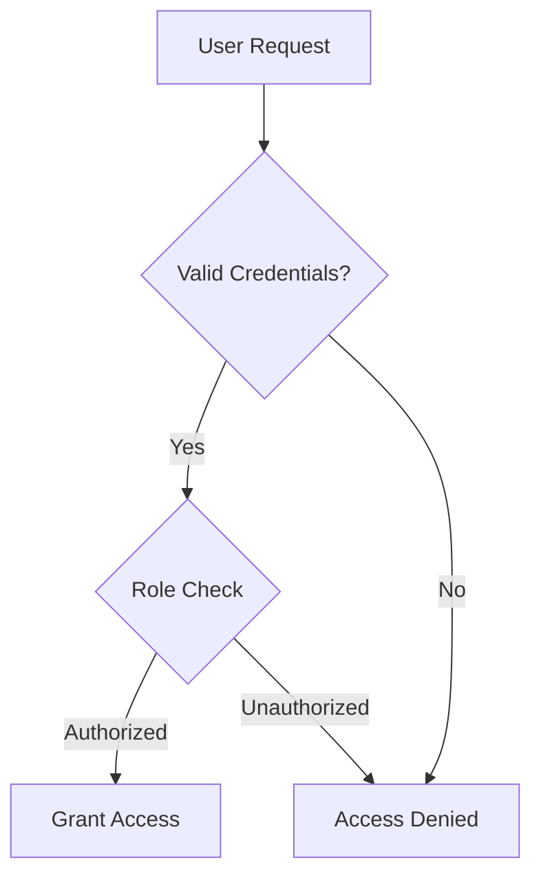
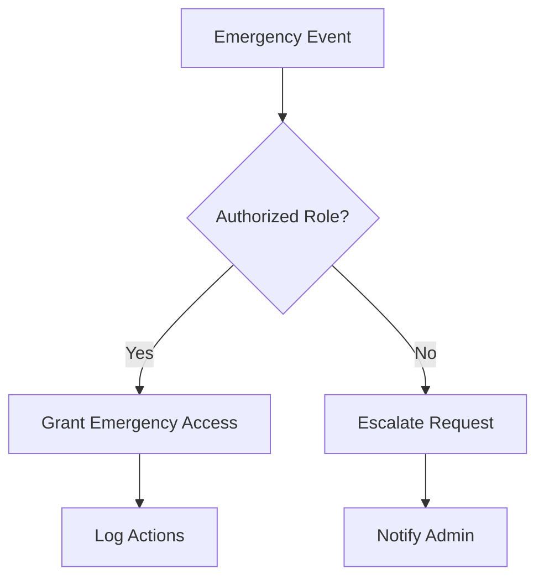
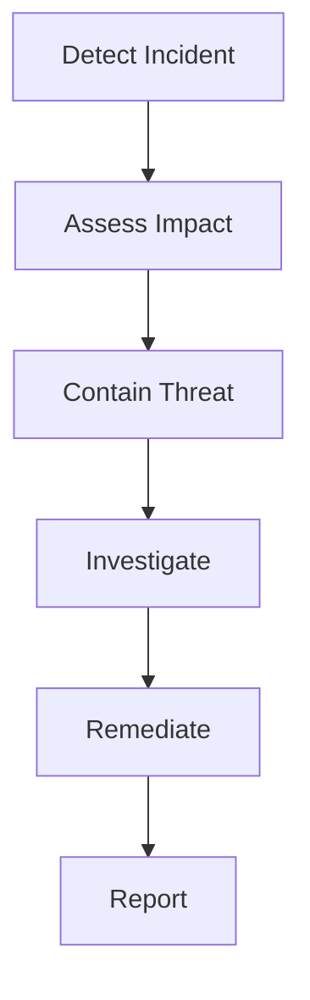

# Security Protocols

## Overview
This document outlines the security protocols and requirements for the CryptoJ Trading system's paper trading implementation.

## Access Control Framework

### 1. Authentication System


### 2. Authorization Levels
```json
{
  "roles": {
    "admin": {
      "permissions": [
        "full_system_access",
        "emergency_controls",
        "configuration_management",
        "user_management"
      ]
    },
    "trader": {
      "permissions": [
        "trading_access",
        "position_management",
        "market_data_access"
      ]
    },
    "risk_manager": {
      "permissions": [
        "risk_monitoring",
        "limit_management",
        "emergency_shutdown"
      ]
    },
    "observer": {
      "permissions": [
        "read_only_access",
        "market_data_view"
      ]
    }
  }
}
```

## Data Security

### 1. Data Classification
**Sensitivity Levels:**
- Level 1: Public Information
- Level 2: Internal Use
- Level 3: Confidential
- Level 4: Highly Confidential

**Data Categories:**
```json
{
  "trading_data": {
    "orders": "Level 3",
    "positions": "Level 3",
    "account_balance": "Level 3",
    "market_data": "Level 2"
  },
  "system_data": {
    "configurations": "Level 4",
    "credentials": "Level 4",
    "audit_logs": "Level 3",
    "metrics": "Level 2"
  }
}
```

### 2. Encryption Requirements
**In Transit:**
- TLS 1.3+ for all communications
- Perfect Forward Secrecy enabled
- Strong cipher suites only
- Certificate validation required

**At Rest:**
- AES-256 for data encryption
- Key rotation schedule
- Secure key storage
- Encrypted backups

## System Security

### 1. Infrastructure Security
**Network Security:**
```yaml
security_measures:
  network:
    - Firewall configuration
    - Network segregation
    - Access control lists
    - Intrusion detection
  
  endpoints:
    - Port restrictions
    - Service hardening
    - Update management
    - Vulnerability scanning
```

### 2. Monitoring Requirements
```json
{
  "security_monitoring": {
    "access_logs": "real-time",
    "system_events": "real-time",
    "authentication": "real-time",
    "anomalies": "real-time"
  },
  "alert_thresholds": {
    "failed_logins": 5,
    "unusual_activity": "immediate",
    "system_changes": "immediate"
  }
}
```

## Risk Management Security

### 1. Trading Controls
**Access Restrictions:**
```python
def validate_trading_access():
    """
    Verify:
    - User authentication
    - Role authorization
    - Trading permissions
    - Risk limits
    - Time restrictions
    """
```

**Operation Limits:**
```json
{
  "trading_limits": {
    "max_order_size": "5%",
    "daily_limit": "20%",
    "frequency_limit": "10/minute",
    "concurrent_orders": 5
  }
}
```

### 2. Emergency Controls
**Access Management:**


## Audit Requirements

### 1. System Auditing
**Audit Scope:**
- Access attempts
- System changes
- Configuration updates
- Security events
- Trading activities

**Audit Records:**
```json
{
  "audit_entry": {
    "timestamp": "ISO8601",
    "user": "string",
    "action": "string",
    "resource": "string",
    "result": "string",
    "details": "object"
  }
}
```

### 2. Compliance Requirements
**Documentation:**
- Security policies
- Access procedures
- Incident response
- Recovery plans
- Audit trails

## Incident Response

### 1. Response Procedures


### 2. Communication Protocol
**Notification Chain:**
1. Security team alert
2. System administrator
3. Risk management
4. Compliance officer
5. Management team

## Recovery Procedures

### 1. Security Recovery
**Steps:**
1. Isolate affected systems
2. Assess damage
3. Secure environment
4. Restore from backup
5. Validate security

### 2. Trading Recovery
**Process:**
1. Verify system integrity
2. Validate positions
3. Check risk limits
4. Test controls
5. Resume operations

## Testing Requirements

### 1. Security Testing
**Test Types:**
- Penetration testing
- Vulnerability scanning
- Security reviews
- Access control testing
- Encryption validation

### 2. Validation Testing
**Areas:**
- Authentication system
- Authorization controls
- Data protection
- Audit logging
- Emergency procedures

## Documentation Requirements

### 1. Security Documentation
- Security policies
- Access procedures
- Incident response
- Recovery plans
- Testing protocols

### 2. Training Documentation
- Security awareness
- Emergency procedures
- Access controls
- Data handling
- Incident reporting

## Compliance Requirements

### 1. Policy Compliance
**Requirements:**
- Security standards
- Trading regulations
- Data protection
- Access control
- Audit requirements

### 2. Review Schedule
**Regular Reviews:**
- Daily security checks
- Weekly access review
- Monthly policy review
- Quarterly audits
- Annual assessment
