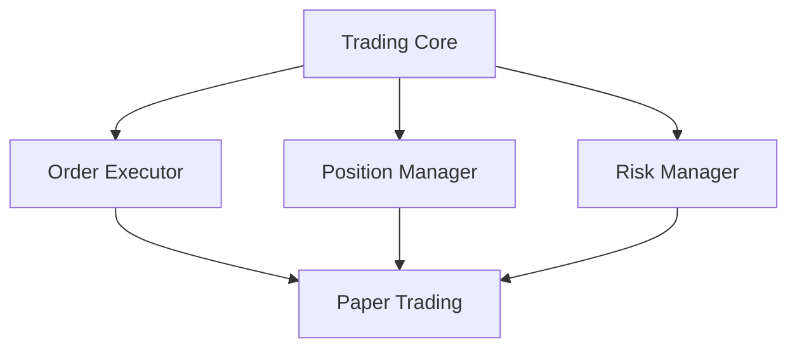
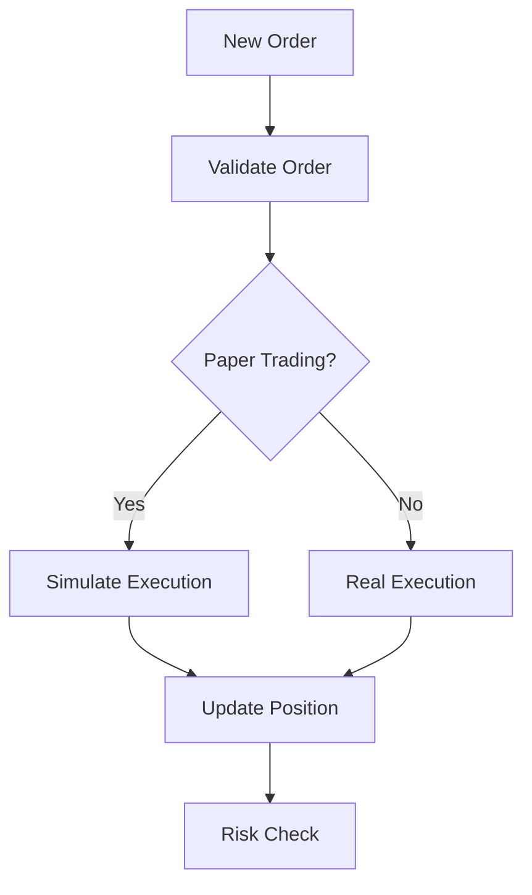
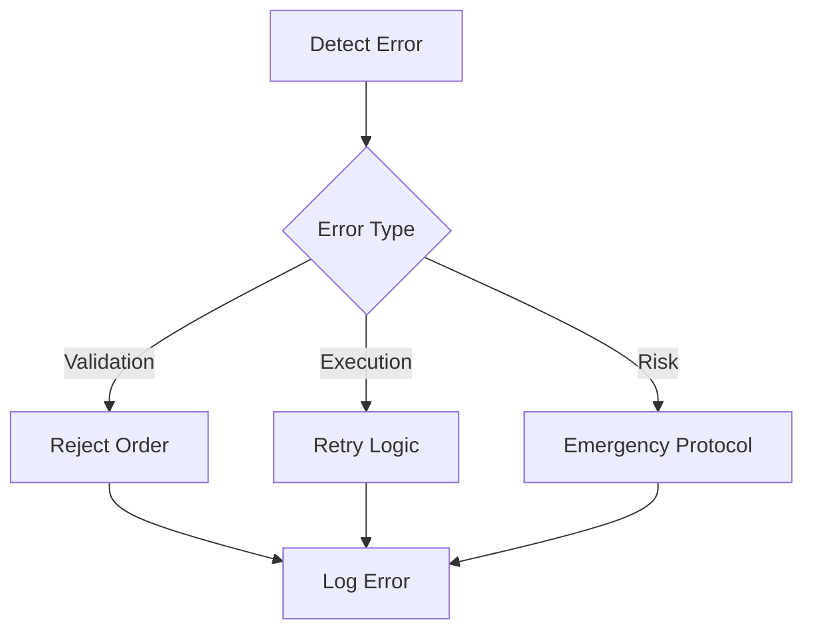

# Trading Engine Technical Documentation

## Overview
This document provides technical details for the CryptoJ Trading system's paper trading engine implementation.

## System Architecture

### 1. Core Components


### 2. Component Responsibilities

#### Trading Core (`trading_core.py`)
```python
class TradingCore:
    """
    Primary trading system coordinator
    - Manages trade lifecycle
    - Coordinates components
    - Ensures system safety
    """
```

#### Order Executor (`order_executor.py`)
```python
class OrderExecutor:
    """
    Handles order execution logic
    - Validates orders
    - Manages execution
    - Tracks order state
    """
```

#### Position Manager (`position_manager.py`)
```python
class PositionManager:
    """
    Manages trading positions
    - Tracks positions
    - Updates P&L
    - Monitors limits
    """
```

## Paper Trading Implementation

### 1. Configuration
```json
{
  "paper_trading": {
    "enabled": true,
    "initial_balance": "100000",
    "trading_pairs": ["BTC-USD", "ETH-USD"],
    "position_limits": {
      "max_position": "5%",
      "max_orders": 10
    }
  }
}
```

### 2. Order Flow


## Integration Points

### 1. Market Data Integration
```python
class MarketDataHandler:
    """
    Handles market data feeds
    - Price updates
    - Order book data
    - Trade execution
    """
```

### 2. Risk Management Integration
```python
class RiskManager:
    """
    Manages trading risk
    - Position limits
    - Loss controls
    - Emergency shutdown
    """
```

## Implementation Details

### 1. Paper Trading Mode
```python
def execute_paper_trade(order):
    """
    Paper trade execution process
    1. Validate order parameters
    2. Check risk limits
    3. Simulate execution
    4. Update positions
    5. Record transaction
    """
```

### 2. Position Tracking
```python
def update_positions(trade):
    """
    Position update process
    1. Calculate new position
    2. Update P&L
    3. Check limits
    4. Record state
    """
```

### 3. Risk Controls
```python
def validate_risk_limits(order):
    """
    Risk validation process
    1. Check position limits
    2. Verify loss thresholds
    3. Validate frequency
    4. Ensure compliance
    """
```

## Error Handling

### 1. Error Types
```python
class TradingError(Exception):
    """Base class for trading errors"""

class ValidationError(TradingError):
    """Order validation errors"""

class ExecutionError(TradingError):
    """Execution-related errors"""

class RiskLimitError(TradingError):
    """Risk limit violations"""
```

### 2. Error Handling Flow


## Testing Requirements

### 1. Unit Tests
```python
class TestOrderExecution:
    """
    Test paper trading execution
    - Order validation
    - Execution logic
    - Position updates
    - Risk controls
    """
```

### 2. Integration Tests
```python
class TestTradingSystem:
    """
    End-to-end system tests
    - Market data integration
    - Order flow
    - Position management
    - Risk monitoring
    """
```

## Monitoring and Logging

### 1. Key Metrics
```json
{
  "performance_metrics": {
    "execution_latency": "ms",
    "order_throughput": "orders/sec",
    "position_accuracy": "percentage"
  }
}
```

### 2. Log Structure
```python
def log_trading_event(event_type, data):
    """
    {
        "timestamp": "ISO8601",
        "event_type": "string",
        "data": {},
        "system_state": {}
    }
    """
```

## Deployment Requirements

### 1. System Requirements
```json
{
  "hardware": {
    "cpu": "4+ cores",
    "memory": "16GB+",
    "storage": "100GB+"
  },
  "software": {
    "python": "3.9+",
    "database": "PostgreSQL 13+",
    "os": "Linux/Windows Server"
  }
}
```

### 2. Configuration Checklist
- [ ] Paper trading mode enabled
- [ ] Risk limits configured
- [ ] Market data feeds connected
- [ ] Monitoring system active
- [ ] Logging configured
- [ ] Backup system ready

## Safety Measures

### 1. Circuit Breakers
```python
def check_circuit_breakers():
    """
    Safety check process
    1. Market conditions
    2. Position limits
    3. Loss thresholds
    4. System health
    """
```

### 2. Emergency Procedures
```python
def emergency_shutdown():
    """
    Shutdown process
    1. Halt trading
    2. Cancel orders
    3. Record state
    4. Alert admin
    """
```

## Validation Process

### 1. Pre-deployment Validation
- System configuration
- Trading parameters
- Risk limits
- Emergency procedures

### 2. Operational Validation
- Order execution
- Position tracking
- Risk monitoring
- Emergency response
