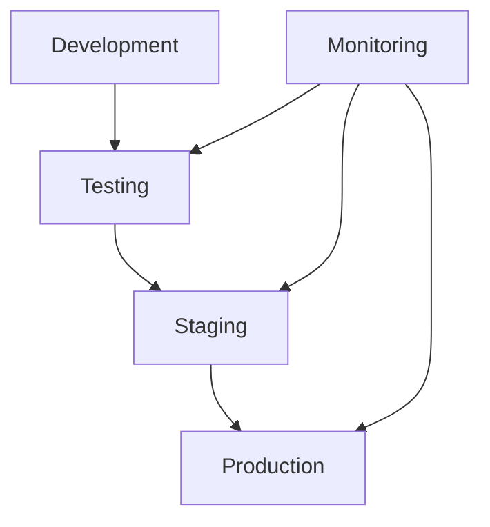
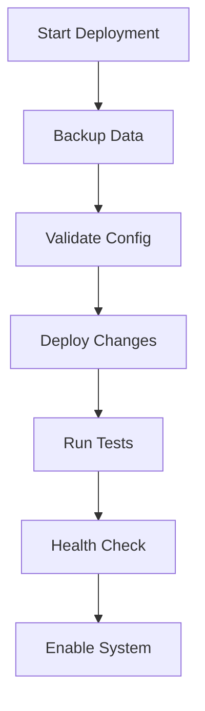
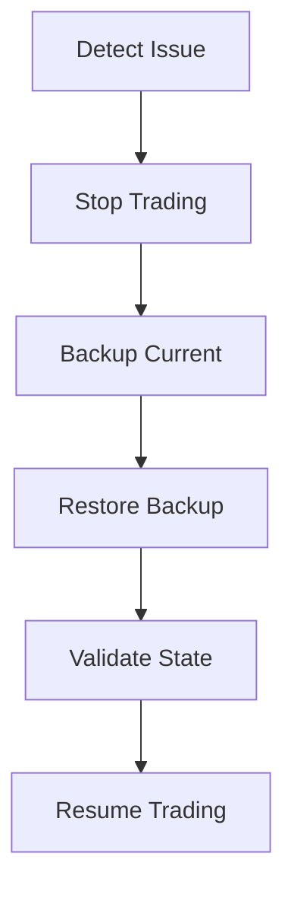
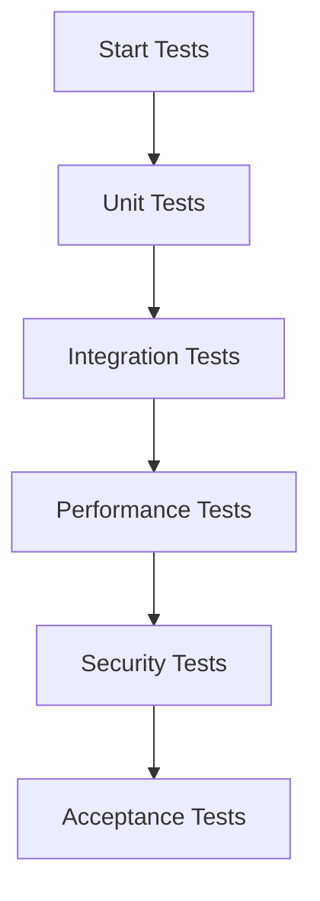

# Deployment and Monitoring Documentation

## Overview
This document outlines the deployment, monitoring, and operational procedures for the CryptoJ Trading system's paper trading environment.

## Deployment Architecture

### 1. Environment Structure


### 2. Environment Configuration
```json
{
  "paper_trading": {
    "env": {
      "dev": {
        "mode": "development",
        "debug": true,
        "logging": "verbose"
      },
      "test": {
        "mode": "testing",
        "debug": true,
        "logging": "debug"
      },
      "staging": {
        "mode": "paper",
        "debug": false,
        "logging": "info"
      },
      "prod": {
        "mode": "paper",
        "debug": false,
        "logging": "warn"
      }
    }
  }
}
```

## Monitoring Setup

### 1. System Metrics
**Core Metrics:**
```json
{
  "system_metrics": {
    "cpu_usage": "percentage",
    "memory_usage": "percentage",
    "disk_usage": "percentage",
    "network_latency": "milliseconds"
  },
  "application_metrics": {
    "order_throughput": "orders/second",
    "position_updates": "updates/second",
    "market_data_latency": "milliseconds",
    "error_rate": "errors/minute"
  }
}
```

### 2. Alerting Configuration
```yaml
alerts:
  system:
    cpu_threshold: 80%
    memory_threshold: 85%
    disk_threshold: 90%
    latency_threshold: 1000ms
  
  trading:
    order_delay: 500ms
    position_sync_delay: 1000ms
    market_data_delay: 2000ms
    error_threshold: 5/minute
```

## Deployment Procedures

### 1. Pre-deployment Checklist
- [ ] Configuration validation
- [ ] Database backup
- [ ] System state snapshot
- [ ] Test suite completion
- [ ] Documentation update
- [ ] Emergency procedures review

### 2. Deployment Steps


## Monitoring Procedures

### 1. Health Checks
**System Health:**
```python
def system_health_check():
    """
    - CPU usage
    - Memory utilization
    - Disk space
    - Network connectivity
    - Service status
    """
```

**Application Health:**
```python
def application_health_check():
    """
    - Trading engine status
    - Market data feed
    - Position tracking
    - Risk monitoring
    - Emergency systems
    """
```

### 2. Log Management
**Log Levels:**
```json
{
  "logging": {
    "emergency": "Fatal system errors",
    "alert": "Critical conditions",
    "critical": "System failures",
    "error": "Error conditions",
    "warning": "Warning conditions",
    "notice": "Normal significant conditions",
    "info": "Informational messages",
    "debug": "Debug messages"
  }
}
```

## Backup Procedures

### 1. Backup Schedule
```yaml
backups:
  system_state:
    frequency: hourly
    retention: 24h
  
  trading_data:
    frequency: 15m
    retention: 7d
  
  configuration:
    frequency: daily
    retention: 30d
```

### 2. Recovery Procedures


## Security Measures

### 1. Access Control
**Environment Access:**
```json
{
  "access_levels": {
    "admin": ["full_access", "emergency_control"],
    "operator": ["monitoring", "trading_control"],
    "viewer": ["monitoring_view"]
  }
}
```

### 2. Security Monitoring
**Security Checks:**
- Authentication logs
- Access attempts
- Configuration changes
- System modifications

## Testing Requirements

### 1. Deployment Testing
**Test Categories:**
- Configuration validation
- System integration
- Performance verification
- Security validation

**Test Sequence:**


### 2. Monitoring Testing
**Validation Tests:**
- Alert triggering
- Metric collection
- Log aggregation
- Recovery procedures

## Recovery Procedures

### 1. System Recovery
**Recovery Steps:**
1. Issue identification
2. System isolation
3. State preservation
4. Backup restoration
5. Service verification

### 2. Data Recovery
**Recovery Process:**
1. Data validation
2. Consistency check
3. State reconstruction
4. Position reconciliation
5. Trading resumption

## Documentation Requirements

### 1. Operational Documentation
- Deployment procedures
- Monitoring setup
- Backup processes
- Recovery steps

### 2. Maintenance Documentation
- Update procedures
- Testing protocols
- Security measures
- Emergency responses

## Success Criteria

### 1. Deployment Success
- Zero deployment errors
- All tests passing
- System performance verified
- Security validated

### 2. Operational Success
- 99.9% uptime
- < 1s response time
- Zero data loss
- Immediate alerts

## Emergency Procedures

### 1. System Emergency
**Response Protocol:**
1. Alert notification
2. Trading suspension
3. State preservation
4. Issue investigation
5. Recovery initiation

### 2. Data Emergency
**Recovery Protocol:**
1. Data isolation
2. Backup verification
3. State restoration
4. System validation
5. Service restoration
