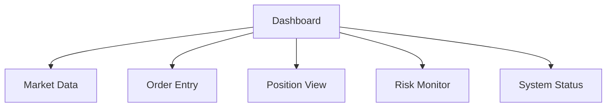

# Trading Interface Documentation

## Overview
This document outlines the frontend requirements and specifications for the CryptoJ Trading system's paper trading interface.

## Interface Components

### 1. Trading Dashboard


### 2. Component Specifications

#### Market Data Display
- Real-time price updates
- Order book visualization
- Trade history
- Market depth charts
- Volume indicators

#### Order Entry Panel
- Order type selection
- Trading pair selection
- Quantity input
- Price input (limit orders)
- Risk parameter display
- Validation feedback

#### Position Monitor
- Open positions table
- Position size indicators
- P&L calculations
- Risk exposure metrics
- Position age tracking

## User Interface Requirements

### 1. Paper Trading Mode
**Visual Indicators:**
- Clear paper trading mode banner
- Simulated balance display
- Test environment markers
- Demo mode notifications

**Trading Controls:**
- Paper trading toggles
- Test mode settings
- Risk limit displays
- Emergency controls

### 2. Risk Management Display
**Risk Metrics:**
```json
{
  "position_metrics": {
    "size": "Percentage of portfolio",
    "risk": "Risk level indicator",
    "exposure": "Total exposure"
  },
  "account_metrics": {
    "balance": "Available funds",
    "positions": "Open position count",
    "risk_level": "Overall risk score"
  }
}
```

## Real-time Updates

### 1. Data Streams
**Market Updates:**
- Price ticks
- Order book changes
- Trade executions
- Position updates

**System Status:**
- Connection state
- Trading status
- System health
- Emergency alerts

### 2. Update Frequency
```json
{
  "price_updates": "100ms",
  "position_updates": "1s",
  "risk_updates": "1s",
  "system_status": "5s"
}
```

## Safety Features

### 1. Visual Indicators
**Risk Levels:**
- Green: Normal operation
- Yellow: Approaching limits
- Orange: High risk
- Red: Emergency state

**Alert Types:**
- Position warnings
- Risk limit alerts
- System status notifications
- Emergency alerts

### 2. Emergency Controls
**Quick Actions:**
- Emergency stop button
- Cancel all orders
- Close all positions
- System reset

## Validation Requirements

### 1. Input Validation
**Order Entry:**
- Size limits
- Price ranges
- Risk parameters
- Position limits

**Risk Controls:**
- Exposure validation
- Loss limit checks
- Frequency controls
- Position verifications

### 2. Display Validation
**Data Quality:**
- Price accuracy
- Position correctness
- P&L calculations
- Risk measurements

## Testing Requirements

### 1. Interface Testing
**Functional Tests:**
- Order entry validation
- Position display accuracy
- Risk control activation
- Emergency response

**Performance Tests:**
- Update latency
- Display refresh
- Action response
- Alert timing

### 2. User Acceptance Criteria
**Usability:**
- Clear status indication
- Intuitive controls
- Responsive feedback
- Error clarity

**Safety:**
- Risk visibility
- Emergency access
- Status awareness
- Control effectiveness

## Implementation Guidelines

### 1. Display Standards
**Visual Hierarchy:**
```css
.emergency-controls {
  /* High visibility positioning */
  position: fixed;
  top: 0;
  right: 0;
  z-index: 1000;
}

.risk-indicators {
  /* Prominent display */
  font-weight: bold;
  color: var(--risk-color);
}

.paper-trading-banner {
  /* Clear mode indication */
  background: var(--warning-bg);
  text-align: center;
}
```

### 2. Interaction Patterns
**Order Entry:**
```typescript
interface OrderValidation {
  validateSize(): boolean;
  validatePrice(): boolean;
  validateRisk(): boolean;
  showFeedback(): void;
}
```

## Monitoring Requirements

### 1. Interface Metrics
**Performance:**
- Render time
- Update latency
- Action response
- Memory usage

**Usage:**
- Error frequency
- Alert responses
- Control usage
- Feature adoption

### 2. Error Tracking
**Capture:**
- Input errors
- Validation failures
- Display issues
- System disconnects

## Documentation Requirements

### 1. User Documentation
- Interface guide
- Control descriptions
- Risk explanations
- Emergency procedures

### 2. Technical Documentation
- Component specifications
- Integration points
- Update mechanisms
- Safety features

## Success Criteria

### 1. Performance Metrics
- Display latency < 100ms
- Update frequency meets specs
- Error rate < 0.1%
- 100% risk alert visibility

### 2. Safety Requirements
- Clear mode indication
- Immediate emergency access
- Real-time risk display
- Accurate position tracking
