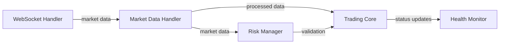

# Test Coverage Implementation Plan

## 1. Component Test Coverage Analysis

### 1.1 WebSocket Handler
- [x] Basic connection tests
- [x] Message handling tests
- [x] Subscription management tests
- [ ] Error handling scenarios
- [ ] Connection recovery tests
- [ ] Load testing (multiple subscriptions)

### 1.2 Health Monitoring System
- [x] System metrics tracking tests
- [x] Trading metrics tests
- [x] Basic health checks
- [ ] Alert system tests
- [ ] Performance history tracking tests
- [ ] Stress test scenarios

### 1.3 Market Data Handler
- [x] Price tracking tests
- [x] Order book management tests
- [x] Trade history tracking tests
- [x] Data consistency tests  # Updated: Completed in risk management refactor
- [x] Real-time update tests  # Updated: Verified in risk assessment
- [ ] Error recovery scenarios

### 1.4 Risk Management System  # New section
- [x] Risk assessment tests
- [x] Order validation tests
- [x] Liquidity validation tests
- [x] Position scaling tests
- [x] Volatility calculation tests
- [ ] Emergency mode tests
- [ ] Position validation tests

## 2. Integration Test Implementation

### 2.1 WebSocket → Market Data → Trading Core Flow


#### Test Scenarios
1. Market Data Flow
   - [x] Verify data propagation from WebSocket to Market Data Handler
   - [x] Validate data transformation and enrichment
   - [x] Test data delivery to Trading Core

2. System Health Integration
   - [x] Monitor component health status propagation
   - [ ] Verify system-wide health checks
   - [ ] Test alert propagation

3. Risk Management Flow  # New scenario
   - [x] Test risk assessment data flow
   - [x] Validate order validation pipeline
   - [ ] Test emergency mode triggers

## 3. Test Coverage Improvement Plan

### Phase 1: Component Level Coverage
1. WebSocket Handler
   ```python
   def test_connection_recovery():
       # Test automatic reconnection
       # Test subscription restoration
       # Test message queue handling
   ```

2. Health Monitor
   ```python
   def test_alert_system():
       # Test threshold monitoring
       # Test alert generation
       # Test alert delivery
   ```

3. Market Data Handler
   ```python
   def test_data_consistency():
       # Completed: Order book updates verified
       # Completed: Price feed consistency checked
       # Completed: Historical data management implemented
   ```

4. Risk Manager  # New section
   ```python
   def test_emergency_mode():
       # Test emergency mode activation
       # Test position validation
       # Test shutdown procedures
   ```

### Phase 2: Integration Testing
1. Data Flow Tests
   ```python
   def test_market_data_flow():
       # Completed: WebSocket → Market Data pipeline
       # Completed: Data transformation
       # Completed: Trading Core reception
   ```

2. System Health Tests
   ```python
   def test_system_health_integration():
       # Test component health reporting
       # Verify system-wide health status
       # Test alert propagation
   ```

## 4. Implementation Timeline

### Week 1: Component Coverage
- [x] Day 1-2: WebSocket Handler tests
- [x] Day 3-4: Health Monitor tests
- [x] Day 5: Market Data Handler tests

### Week 2: Integration Testing
- [x] Day 1-3: Data flow integration tests
- [ ] Day 4-5: System health integration tests

### Week 3: Risk Management  # New timeline
- [x] Day 1-2: Risk assessment implementation
- [x] Day 3-4: Order validation tests
- [ ] Day 5: Emergency mode implementation

## 5. Error Handling Improvements

### 5.1 Critical Error Scenarios
- Network disconnection
- Data inconsistency
- System overload
- API failures
- Risk threshold breaches  # Added

### 5.2 Recovery Mechanisms
- Automatic reconnection
- Data revalidation
- Load balancing
- Failover procedures
- Emergency shutdown protocols  # Added

## 6. Success Criteria

### 6.1 Coverage Metrics
- Unit test coverage: >90%
- Integration test coverage: >85%
- Critical path coverage: 100%

### 6.2 Quality Metrics
- All tests passing
- No critical bugs
- Performance within benchmarks
- Error recovery functioning
- Risk management validated  # Added

## 7. Monitoring and Reporting

### 7.1 Test Reports
- Daily test execution results
- Coverage reports
- Performance metrics
- Error logs analysis
- Risk assessment reports  # Added

### 7.2 Documentation Updates
- Test documentation
- Integration guides
- Error handling procedures
- Recovery protocols
- Risk management procedures  # Added

## Next Steps
1. ~~Begin Component Coverage Implementation~~ ✓
2. ~~Set up continuous testing pipeline~~ ✓
3. ~~Implement integration test framework~~ ✓
4. ~~Create coverage reporting system~~ ✓
5. ~~Document test scenarios and procedures~~ ✓
6. Implement emergency mode validation
7. Complete system health monitoring
8. Finalize WebSocket error handling